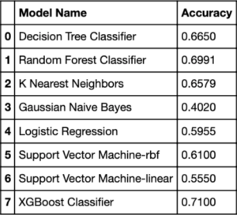
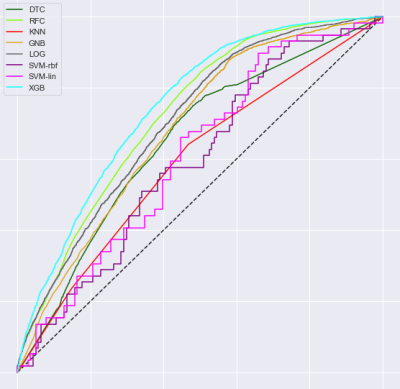

# Traffic Jam

## IBM Data Science - Capstone Project

Author: Peter McMaster, 2021

### Problem Statement

Traffic sucks. It's not only annoying, but costly and dangerous. Technology can help by providing insight for policy, alleviating road congestion and decreasing the frequency and severity of accidents. This project is a continuation of research performed by the Research and Development Team at Lyft to investigate the factors surrounding car accidents.

The data used here consist in a 3.5-million observation dataset of US Car Accidents from 2016 to 2020 and include environmental factors such as:

- location
- road signage
- time of day
- weather

The goal is to explore this data to uncover insights and correlations which may guide public policy and increase road safety. The original authors of the dataset conducted experiments to predict accident likelihood of any given intersection at any given time within city blocks. This project celebrates and continues their research by experimenting with various models on a binary classification task - to predict accident severity (high or low) given environmental parameters using:

- Logistic Regression
- K-Nearest Neighbors
- Naive Bayes
- Decision Tree
- Random Forest
- Support Vector Machines (linear & rbf kernels)
- XGBoost

### Results

XGBoost outperformed the rest, achieving an improvement of 21 percentage points over the baseline of a random classifier.

### Methodology

##### **1. Imports**

##### **2. Data Wrangling**

- Import Data
- Inspect Data
- Data Cleaning (Round 1)
- Data Cleaning (Round 2)

##### **3. Exploratory Data Analysis**

- #EDA 1: Full Dataset
  - Pie Plots
  - Cat Plots
  - Line Plots
  - Box and Whisker Plots
- EDA 2: Data Subsets
  - Create Subsets
  - Pie Plots
  - Multiline Plots
    - Probability Density Functions of continuous variables compared
    - Skewness
- Maps (Los Angeles, CA)
  - Base Map
  - Accidents Markers
  - Zipcode Choropleth Map

##### **4. Machine Learning**

- Feature Sets
  - df50: (X, y)
  - df: (Xall, yall)
  - dfsvm: (Xsvm, ysvm)
- Models
  - Decision Tree Classifier
  - Random Forest Classifier
  - K Nearest Neighbors
  - Naive Bayes (Guassian)
  - Linear Regression
  - Logistic Regression
  - Support Vector Machine
  - XGBoost

##### **5. Results, Discussion, Recommendation**

### Data

Data Source: https://osu.app.box.com/v/us-accidents-june20

#### Metadata

This dataset consists of car accidents reports within 49 states of the U.S. in the date range from February 2016 through June 2020. These data have been sourced from several data providers, including 2 APIs (Mapquest, Bing) and a host of related entities (the US and state departments of transportation, law enforcement agencies, traffic cameras, and traffic sensors within the road-networks). There are approximately 3.5 million accident observations and exactly 49 columns of heterogeneous data in this dataset. For additional information follow this link to https://smoosavi.org/datasets/us_accidents.

#### Acknowledgements:

<cite>Moosavi, Sobhan, Mohammad Hossein Samavatian, Srinivasan Parthasarathy, and Rajiv Ramnath. “A Countrywide Traffic Accident Dataset.”, arXiv preprint arXiv:1906.05409 (2019).</cite>

<cite>Moosavi, Sobhan, Mohammad Hossein Samavatian, Srinivasan Parthasarathy, Radu Teodorescu, and Rajiv Ramnath. “Accident Risk Prediction based on Heterogeneous Sparse Data: New Dataset and Insights.” In proceedings of the 27th ACM SIGSPATIAL International Conference on Advances in Geographic Information Systems, ACM, 2019.</cite>
